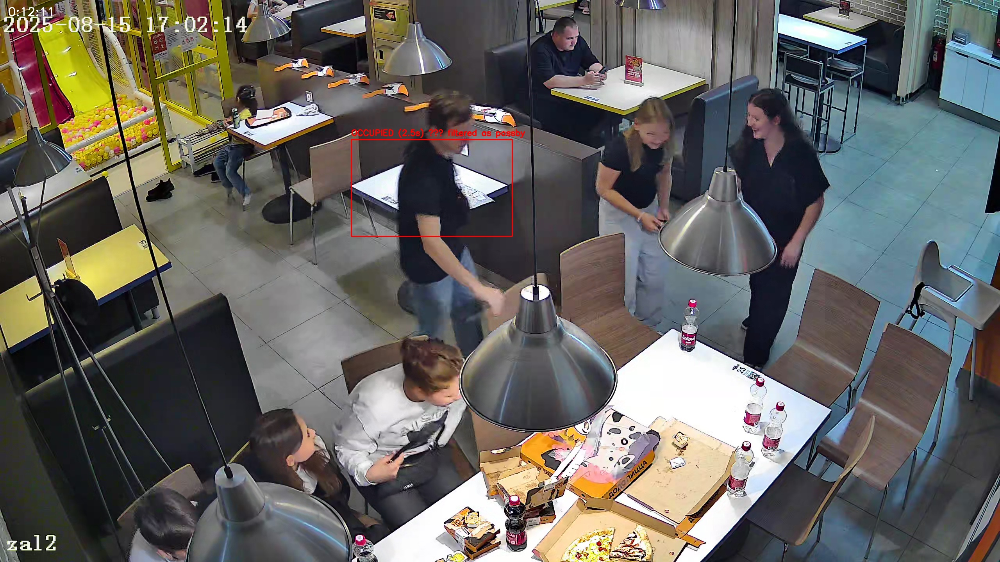

# Table Detector — Прототип системы детекции уборки столиков

Упрощённый, но рабочий прототип CV-пайплайна для анализа видео с камеры кафе.
Система отслеживает один выбранный столик и фиксирует события присутствия людей.

---

## Как запустить

### 1. Клонировать репозиторий
```bash
git clone https://github.com/Tig-Lakt/table_detector/
cd table_detector
```

### 2. Создать виртуальное окружение
```bash
# Linux
python3 -m venv venv
source venv/bin/activate
```

### 3. Установить зависимости
```bash
pip install -r requirements.txt
```

### 4. Запустить
```bash
python main.py --video video1.mp4
```

При первом запуске автоматически скачаются веса модели YOLOv8n (~6MB).

---

## Выбор зоны столика

Зона столика задаётся вручную через `cv2.selectROI` на первом кадре видео.
Для этого используется отдельный скрипт:

```bash
python select_roi.py
```

Скрипт открывает окно с первым кадром — нужно выделить зону столика мышкой
и нажать ENTER. В терминале появятся координаты `(x, y, width, height)`,
которые вставляются в константы `ROI_X, ROI_Y, ROI_W, ROI_H` в `main.py`.

**Выбранный столик:** центральный столик в кадре (№23, с видео 1), координаты ROI = `(899, 357, 412, 248)`.

---

## Логика детекции событий

**Модель:** YOLOv8n (nano) — детектирует людей (класс `person`, confidence > 0.5).
Модель предобученная, дообучение не проводилось.

**Определение присутствия человека в зоне — IoU:**
Простое пересечение bbox человека с зоной столика давало ложные срабатывания
от людей за соседними столами. Поэтому используется IoU (Intersection over Union) —
человек считается присутствующим у столика только если минимум 25% его тела
попадает в зону ROI. Дополнительно используются только нижние 2/3 bbox (тело
без головы) — это точнее отражает где человек физически стоит.

**Дебаунсинг:**
Состояние столика меняется только если оно стабильно 15 кадров подряд.
Устраняет дёрганье когда человек стоит на границе зоны.

**Постфильтрация коротких присутствий:**
После основного цикла из таблицы событий удаляются пары `EMPTY → OCCUPIED` /
`OCCUPIED → EMPTY` где стол был занят менее 3 секунд. Это отсекает проходы
официантов мимо столика. Фильтрация реализована как постобработка DataFrame,
а не в основном цикле — это не влияет на внутренние переменные состояния.

**Три состояния:**
| Состояние | Условие | Цвет bbox |
|---|---|---|
| EMPTY | в зоне нет ни одного человека | 🟢 Зелёный |
| OCCUPIED | в зоне есть человек дольше 3 секунд | 🔴 Красный |
| Подход к столу | переход EMPTY → OCCUPIED | фиксируется в логе |

---

## Результаты

**Видео:** запись с фиксированной камеры в кафе, длительность ~14 минут, 20 fps.

**Наблюдение:** выбранный столик за период записи оставался практически пустым.
Система корректно это зафиксировала — зафильтровав проходы мимо как ложные
срабатывания. Это подтверждает что пайплайн работает правильно: он не генерирует
события там где их нет.

| Метрика | Значение |
|---|---|
| Длительность видео | ~14 минут |
| Реальных подходов к столу | 1 |
| Отфильтровано проходов мимо | 3 |
| Среднее время до следующего гостя | н/д (мало данных) |

**Отфильтрованные ложные срабатывания:**
```
[SKIP] проход мимо 0:12:11 (2.5с) — убираем из отчёта
[SKIP] проход мимо 0:12:27 (0.8с) — убираем из отчёта
[SKIP] проход мимо 0:13:24 (1.1с) — убираем из отчёта
```

---

## Известные ограничения

- Система не различает гостей и персонал (нет детекции по униформе)
- Оптимизировано под один столик; для масштабирования нужен рефакторинг ROI-логики
- При сильном перекрытии столика другим человеком возможны пропуски событий
- Координаты ROI задаются вручную — при смене камеры нужно переопределять

---

## Стек

| Библиотека | Версия | Назначение |
|---|---|---|
| Python | 3.12 | — |
| OpenCV | 4.13 | чтение видео, отрисовка, запись |
| Ultralytics | latest | YOLOv8n, детекция людей |
| Pandas | 2.3 | таблица событий, статистика |

## Пример проблемного кадра


Посетитель проходит мимо столика — система зафиксировала присутствие (2.5с),
но постфильтрация корректно убрала это событие как проход мимо.

## Результирующее видео

[Скачать output.mp4](https://drive.google.com/file/d/19O6n0_1o1pHnWGuFlD-uxy7feqKXUL-F/view?usp=drive_link)

